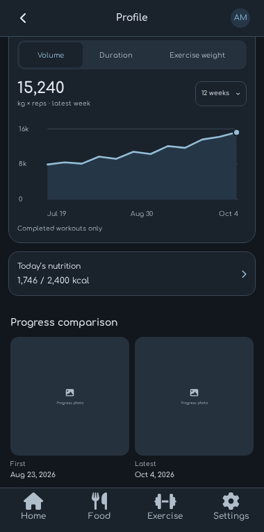
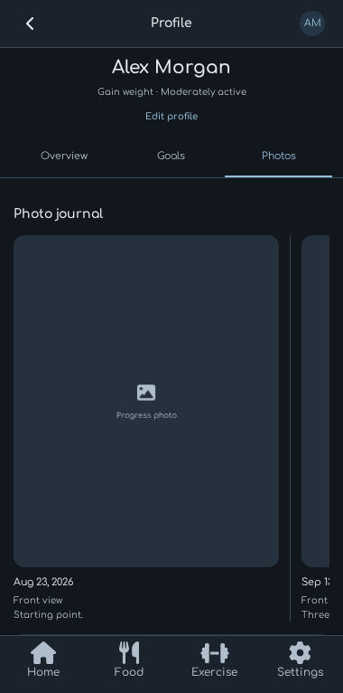
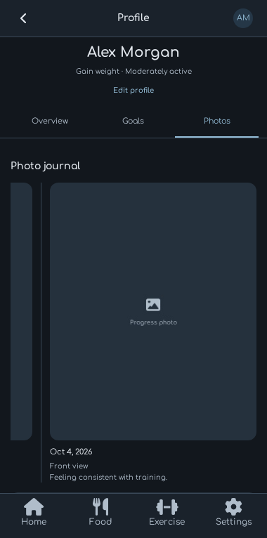

# Profile carousel revision — October 4, 2026

The Profile page now uses the same bottom navigation icon, label, and bar sizes
as the four main tabs. Its streak calendar shows the current Sunday-to-Saturday
week; current and longest streak calculations still use consecutive logged days.

Overview's **Progress comparison** shows the earliest dated saved photo on the
left and the latest on the right, with full dates below. Both endpoints come from
the complete gallery. Date ties use stable ID ordering, one photo fills both
positions, and an empty gallery shows empty placeholders. The section has no
Add or Compare controls.

Photos is a horizontal carousel ordered by date, with a full date beneath each
photo and a vertical separator between adjacent entries. Images use contain-fit
display. Photo presses still open the date/note/replace/remove editor, and adding
from the library or camera remains available in Photos. Arbitrary two-photo
selection and its comparison dialog have been removed.

## Verification

- `npm run check`: TypeScript and all 565 direct tests passed.
- `npx tsc --noEmit --noUnusedLocals --noUnusedParameters`: passed.
- `npm run test:browser`: 137 passed, zero failures, one expected opt-in visual
  capture skipped. The opt-in capture was also run separately and passed.
- Browser coverage includes unchanged navigation dimensions, Sunday-first week
  dates, nonchronological photo additions, earliest/latest updates after date
  edits and deletion, single/empty states, horizontal scrolling at 320px and
  390px widths, separator geometry, persistence, and existing editor failure and
  lifecycle checks.
- Web, iOS, and Android exports passed.
- Android emulator: library additions, dated photo editing, horizontal carousel
  swipes, separators, dates, first/latest previews, and deletion worked. The
  horizontal gesture kept the page's vertical position. Temporary app photos
  and their library fixtures were removed afterward; the original profile and
  empty gallery were restored.
- Independent source review found no actionable defects. `git diff --check`
  passed.

Physical-iPhone picker/camera and accessibility verification remains on TODO.md.

## Captures

The captures use isolated sample data and do not represent the user's records.

