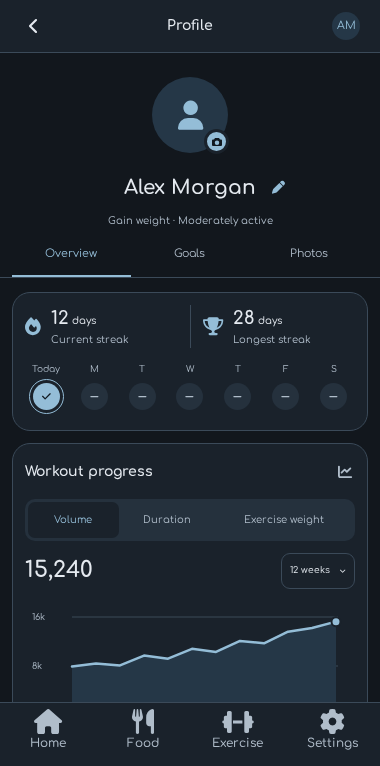
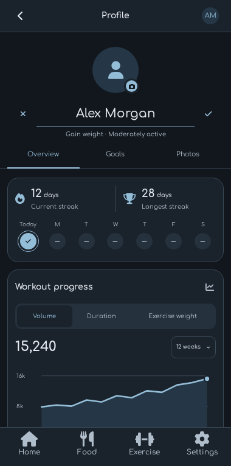

# Profile identity and caption cleanup

Removed the three captions marked in the user's screenshot: the streak
explanation, workout unit/latest-week caption, and completed-workout/empty-range
footer. Removed the identity's Edit profile button and its navigation callback.

A small pencil beside the name now opens an underlined name field in place,
centered beneath the avatar, with Cancel on the left and Save on the right.
Checkmark or keyboard Done saves; the cross or Escape cancels. Saving validates
the existing name rules and updates only the name in the current saved profile.
Failures preserve the draft for retry, pending saves block duplicate writes,
and editing keeps the selected Profile section. Other goal editors remain
available. The camera uses a centered SVG drawing inside its badge to remove
icon-font baseline offsets.

Validation completed:

- `npm run check`: TypeScript and 565 direct tests passed.
- Profile browser suite: 21 passed, no failures, one expected optional capture
  skipped.
- Final focused run: four inline-name tests and the optional visual capture
  passed. Coverage includes cancel/save/reload, validation, failed-write retry,
  pending section saves, duplicate prevention, 320px width, underline styling,
  and camera centering.
- The subsequent alignment revision passed the same four focused name tests
  and visual capture, with geometric checks for name centering, left/right
  actions at 320px and 390px widths, and the camera's visible drawing bounds.
- TypeScript with unused-local/parameter checks passed.
- Web, iOS, and Android exports passed.
- Android emulator showed the pencil, underlined input, keyboard and save/cancel
  controls, centered camera glyph, and removed captions. Cancel restored the
  original name without writing user data.
- The collaborative web preview confirmed in-place editing and centering.
  `git diff --check` passed.

The screenshots use isolated sample data.

